# DESARROLLO DE UN CLIENTE BITTORRENT

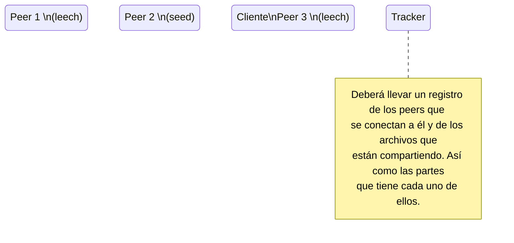

## Anunciarse al tracker

El cliente se conectará al tracker para anunciar los archivos que tiene asociados al tracker. El tracker llevará un registro de los peers que se conectan a él y de los archivos que están compartiendo. Así como las partes que tiene cada uno de ellos.

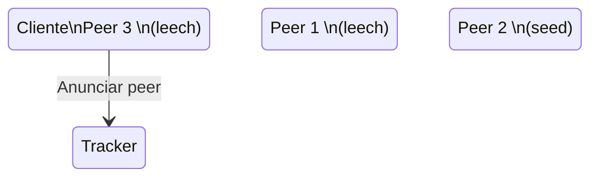

## Descargar partes

El cliente solicitará la lista de peers, del archivo que quiere descargar, al tracker.

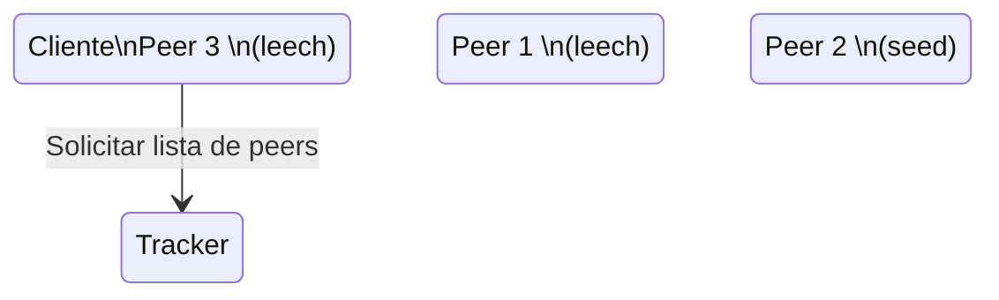

A partir de la lista de peers, el cliente se conectará a cada uno de ellos para descargar las partes que le faltan. Para ello, se establecerá una conexión TCP con cada uno de ellos.

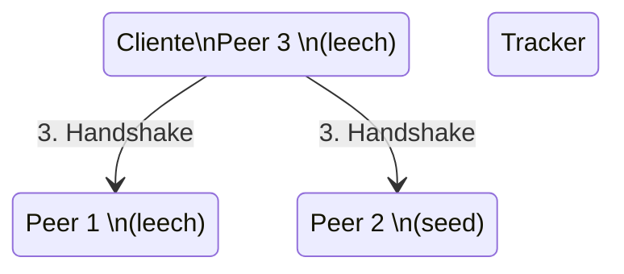

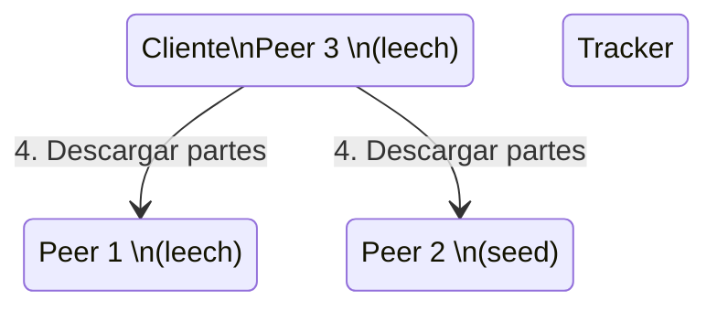

## Actualización del tracker

El tracker cada cierto tiempo pedirá a los peers que le envíen la lista de partes que tienen. El tracker actualizará la información de los peers y de los archivos que están compartiendo.

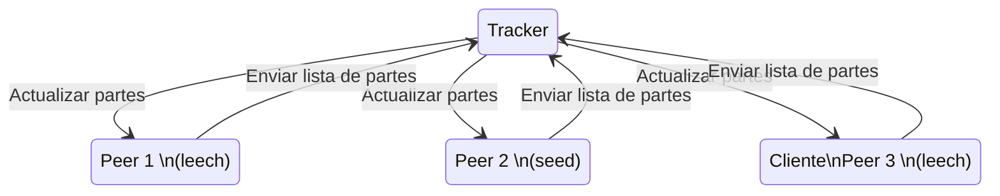

## Actualización de peers

El cliente cada cierto tiempo pedirá al tracker la lista de peers que tienen el archivo que quiere descargar. El cliente actualizará la lista de peers. En caso de que haya nuevos peers, el cliente se conectará a ellos para descargar las partes que le faltan.

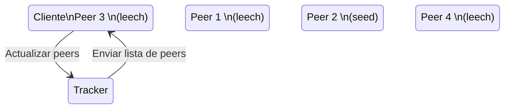

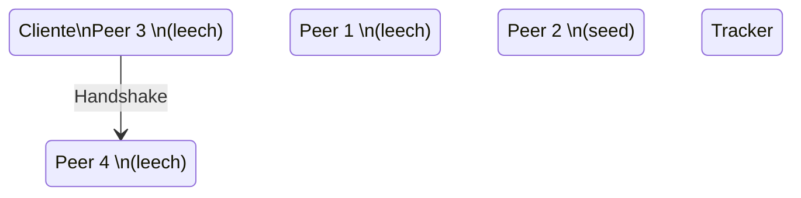

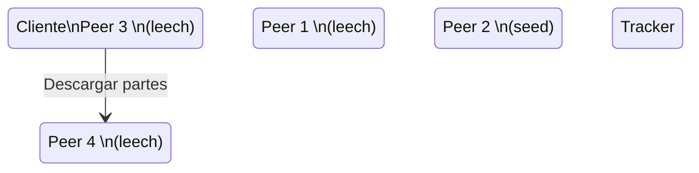

## Manejo de desconexiones

En caso de que un peer se desconecte, los peers que estén conectados a él deberán guardar las partes que han descargado hasta el momento. Así como el número de bytes que han descargado. En caso de que el peer se vuelva a conectar, los peers que estén conectados a él deberán enviarle las partes que han descargado hasta el momento. Así como el número de bytes que han descargado.

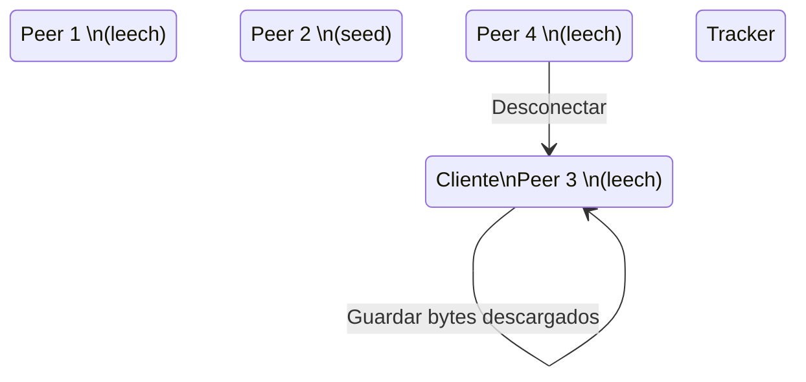

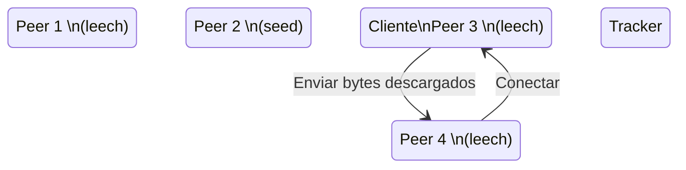

En caso de que el peer que se desconectó no se vuelva a conectar antes de que el cliente termine de descargar las partes que le faltaban, el cliente deberá conectarse a otro peer para reanudar la descarga de la parte desde el byte en que se quedó.
